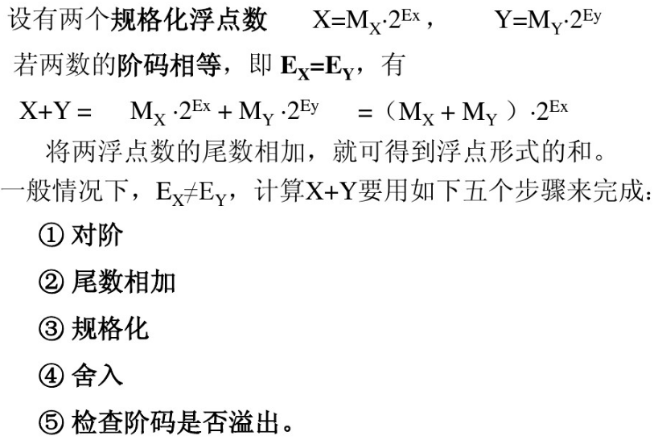
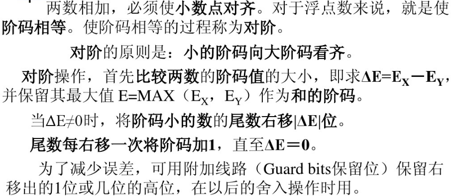
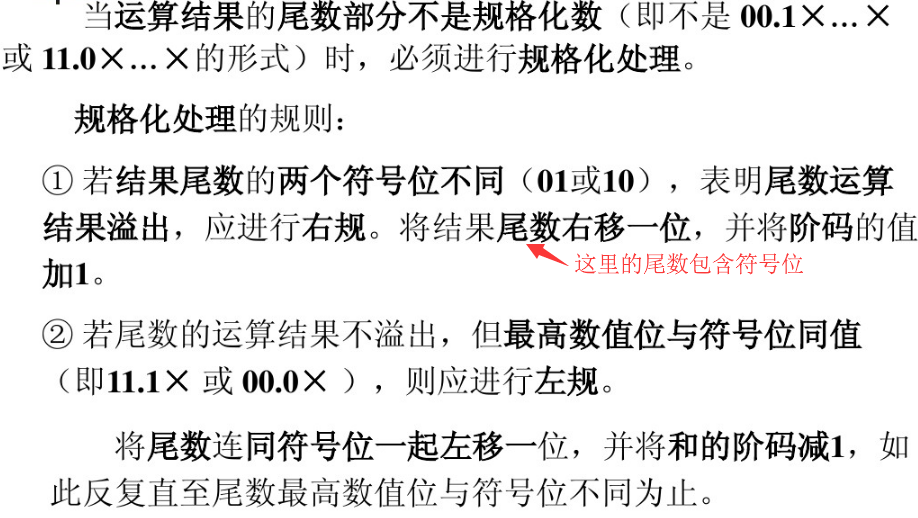
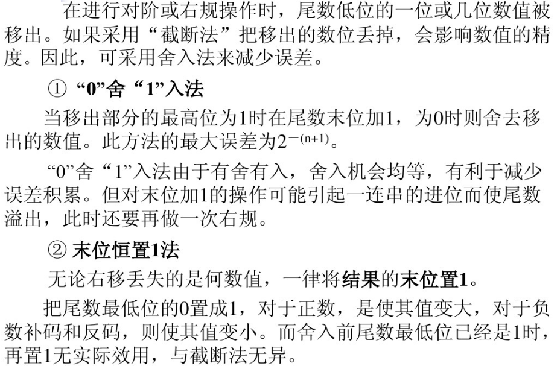
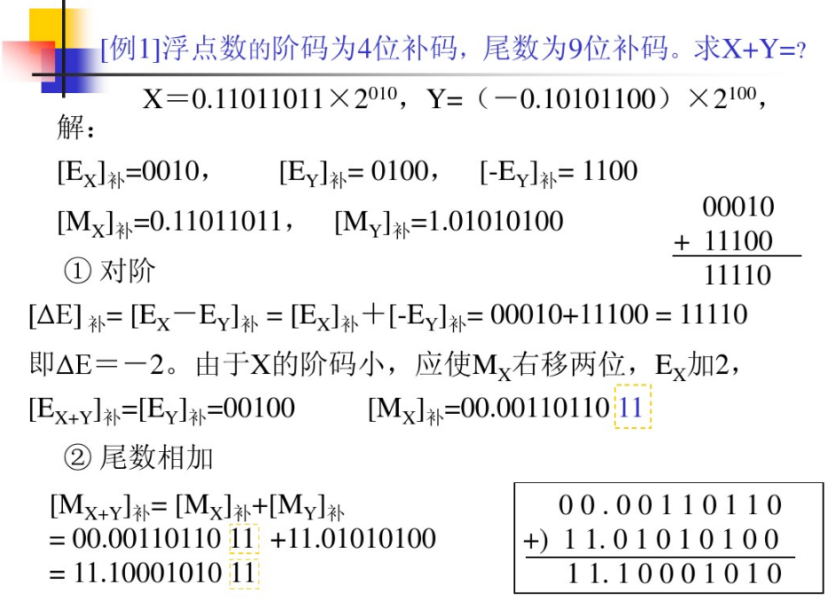
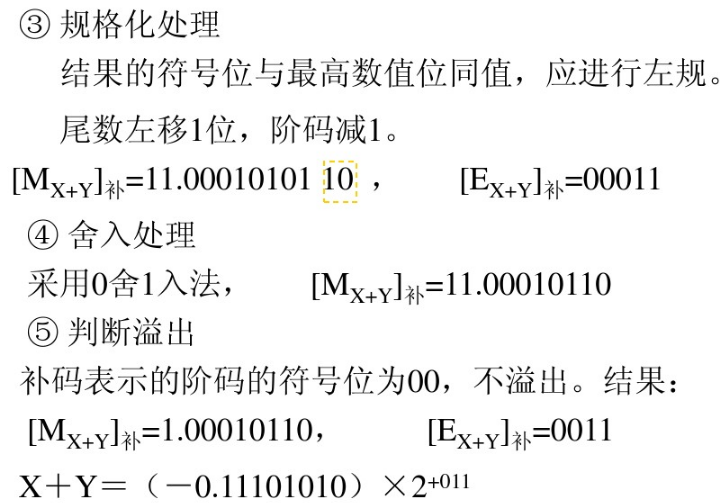
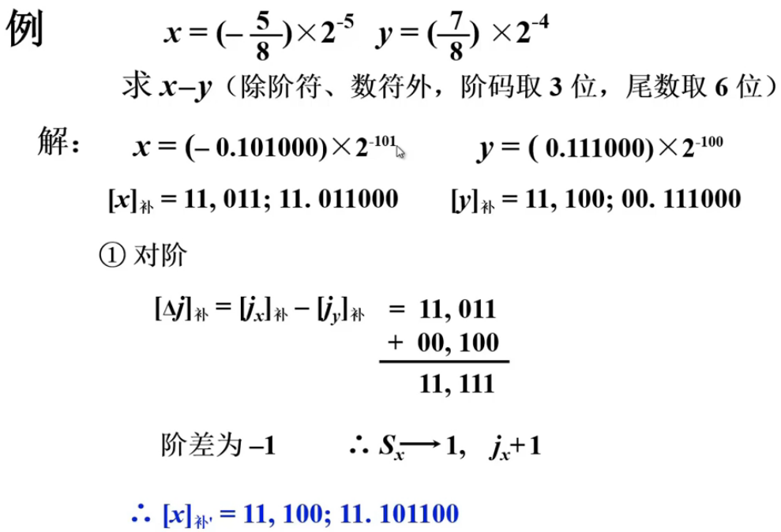
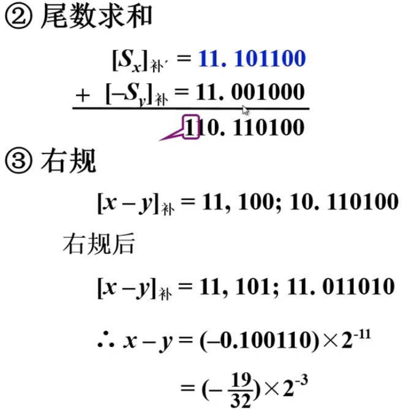
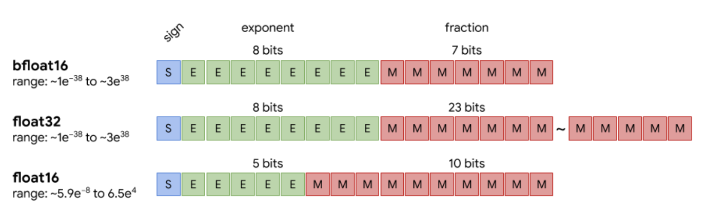

## Floating Point Number Arithmetic Operations

浮点数的加减法。
浮点运算要把阶码和尾数分别处理。

```
ｘ＝ Mx * 2^(Eｘ)
y＝ My * 2^(Ey)
```
两浮点数进行加法和减法的运算规则是:

```
ｘ±ｙ＝(Mｘ*2^(Eｘ－Eｙ) ± Mｙ)*2^Eｙ，　　Eｘ<＝Eｙ
```
其中，Ex、Ey分别为x、y的阶码，Mx、My分别为尾数。

**阶码的运算**是**定点整数运算**，对阶码的运算四种：阶码加1，阶码减1，两阶码求和，两阶码求差。

**尾数的运算**是**定点小数运算**，运算过程中一般取双符号位。

**浮点运算器**总是由`处理阶码`和`处理尾数`的两部分组成。

### 1. 浮点数溢出(overflow)
当一个数的大小超出了浮点数的表示范围时，机器无法表示该数，就发生`溢出(overflow)`。浮点数的溢出判断方法`与定点数不同`，是对`规格化数的阶码进行判断`。

当浮点数的阶码大于机器所能表示的最大阶码时（即阶码发生`正溢出`），此时机器应停止运算，进行出错中断处理。

浮点数的尾数运算的溢出可以通过`右规消除`，所以不算溢出。

当浮点数的阶码小于机器所能表示的最小阶码时（即阶码发生`负溢出`），这时一般规定把该浮点数的尾数强迫置零，作为零处理，机器可继续运行。

当一个浮点数的尾数为0，不论其阶码为何值，或者阶码的值小于等于都把该浮点数看成零值，称为机器零。


### 2. 浮点加减法运算




#### 2.1 对阶



由于浮点表示的数多是规格化的，尾数左移会引起最高有产位的丢失，造成很大误差；而尾数右移虽引起最低有效位的丢失，但造成的误差较小，因此，对阶操作规定使尾数右移，尾数右移后使阶码作相应增加，其数值保持不变。很显然，一个增加后的阶码与另一个相等，所增加的阶码一定是小阶。因此在对阶时，总是使**小阶向大阶看齐**。

#### 2.2 尾数相加(Mantissa)

完成对阶后，将两浮点数的尾数部分相加，方法**与定点小数加法相同**。

对阶完毕后就可对尾数求和。不论是加法运算还是减法运算，都按加法进行操作，其方法与定点加减运算完全一样。

#### 2.3 规格化(Normalize the result)

当尾数用二进制表示时，浮点规格化的定义是尾数M应满足：

```
1/2 ≤ |M| < 1

```
对于正数而言，有M = 00.1φφ…φ；对于负数，其补码形式为11.0φφ…φ（即-0.0*******，左归）.



#### 2.4 舍入操作(Rounding)




#### 2.5 检查阶码是否溢出（Check the Exponent Overflow or Underflow）

若阶码正常，加减运算正常结束；若阶码下溢，要置运算结果为浮点形式的机器零；若阶码上溢，则置溢出标志

### Examples










### 关于DNN领域混合精度对准确率影响的思考

在DNN领域，低精度运算对准确率的影响。

Mixed precision training, NVIDIA and Baidu paper: <https://arxiv.org/abs/1710.03740> and slides: <https://nvlabs.github.io/iccv2019-mixed-precision-tutorial/files/dusan_stosic_intro_to_mixed_precision_training.pdf> & <https://developer.download.nvidia.cn/video/gputechconf/gtc/2019/presentation/s9143-mixed-precision-training-of-deep-neural-networks.pdf>

Google的TPU为何要采用BFloat16?

<https://cloud.google.com/blog/products/ai-machine-learning/bfloat16-the-secret-to-high-performance-on-cloud-tpus>

TensorFlow中BFloat16的实现：

[bfloat16.h](https://github.com/tensorflow/tensorflow/blob/master/tensorflow/core/framework/bfloat16.h) and [bfloat16.cc](https://github.com/tensorflow/tensorflow/blob/master/tensorflow/core/framework/bfloat16.cc)

测试用例：
[bfloat16_test.cc](https://github.com/tensorflow/tensorflow/blob/master/tensorflow/core/framework/bfloat16_test.cc)

The format that was the workhorse of deep learning for a long time. Another IEEE 754 format, the single-precision floating-point with:

- 1 bit sign
- 8 bits exponent
- 23 bits fraction

In the IEEE 754 standard format, the `half-precision` floating-point format with:

- 1 bit sign
- 5 bits exponent
- 10 bits fraction

BFLOAT16 solves this, providing dynamic range identical to that of FP32.

- 1 bit sign
- 8 bits exponent
- 7 bits fraction



<https://moocaholic.medium.com/fp64-fp32-fp16-bfloat16-tf32-and-other-members-of-the-zoo-a1ca7897d407>


### REFs

- <http://weitz.de/ieee/>
- <https://en.wikipedia.org/wiki/Half-precision_floating-point_format>
- <https://en.wikipedia.org/wiki/Bfloat16_floating-point_format>
- <https://blog.csdn.net/chen_lady/article/details/51105744>
- <https://blog.csdn.net/qq_37236745/article/details/83513418>
