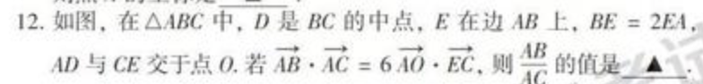
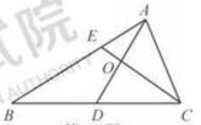

## p12





Solution:
以A为原点，向量AB和AC为基底，建立斜坐标系，假设|AC| = 1, |AB| = n，则题目可以转化成求n的值。
`向量AB`在斜坐标系中可以表示为(0, n)，`向量AC`可以表示为(1, 0)，D是BC的中点，所以向量AD在斜坐标系中可以表示为(1/2, n/2).

`向量EC` = `向量AC` - `向量AE` = `向量AC` - 1/3`向量AB`;
所以`向量EC`可以表示为(1, -n/3)；
假设O在斜坐标系中的坐标为(x, y)，则根据已知的等式可以得到：

`6(x, y) * (1, -n/3) = 0;`

所以`y = 3x/n`；

所以`向量AO` = (x, 3x/n)；
因为向量AO与向量AD共线，

`向量AD` =（1/2, n/2），所以有

```
x / (1/2) = 3x/n / (n/2)；
所以，得到n^2 = 3， 所以n = sqrt(3).
```

so we get `|AB| / |AC| = sqrt(3)`.
