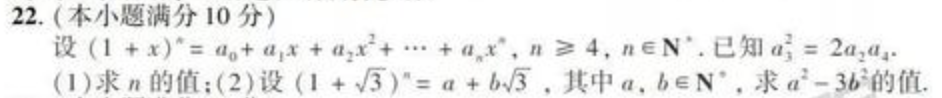

## p22




Solution:

对于第(2)问的一般情况，

```
if (1 + sqrt(3))^n = a + b * sqrt(3), then
(1 - sqrt(3))^n = a - b * sqrt(3)

a^2 - 3*b^2 = (a + b * sqrt(3))*(a - b * sqrt(3))
= (1 + sqrt(3))^n * (1 - sqrt(3))^n
= (1 - 3)^n
= (-2)^n
```
第(2)问为n = 5时的特化版本，结果为-32.
