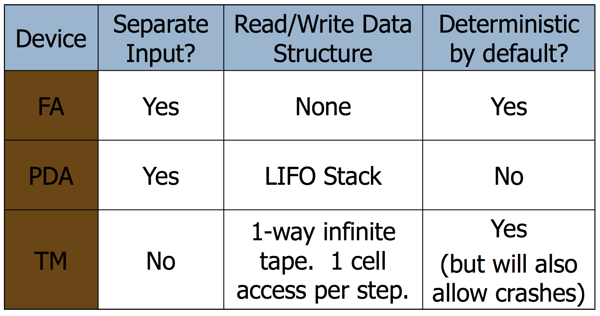

## 1. Introduction

**Programming Languages History**

- `Most concepts were invented in the 40s through 70s`
  - A few in the 80s, even less in the 90s
  - Lots of detail work, combinations and optimizations
- People keep reinventing things, when the context is right
- `"Know the past to understand the present"`

This course not covered: implementation of PLs. Recommended:

- CS 241 Advanced Compiler Construction
- EECS 221 Program Analysis

**Course Outline**

- Historical Languages
- Basics of PLs
- Function composition
- Objects and object interactions
- Reflection and metaprogramming
- Adversity: dealing with the outside world
- Data-centric concepts
- Concurrency
- Interactivity

## 2. Turing Machines

**Alan Turing**

Alan Turing was one of the founding fathers of CS.

- His computer model--the Turing Machine–-was inspiration/premonition of the electronic computer that came two decades later
- Was instrumental in cracking the Nazi Enigma cryptosystem in WWII
- Invented the “Turing Test” used in AI
- Legacy: The Turing Award.

From his paper at year 1936, "ON COMPUTABLE NUMBERS, WITH AN APPLICATION TO THE ENTSCHEIDUNGSPROBLEM"

> The "computable" numbers may be described briefly as the real numbers whose expressions as a decimal are calculable by finite means. Although the subject of this paper is ostensibly the computable numbers, it is almost equally easy to define and investigate computable functions of an integral variable or a real or computable variable, computable predicates, and so forth. `The fundamental problems involved are, however, the same in each case, and I have chosen the computable numbers for explicit treatment as involving the least cumbrous technique`. I hope shortly to give an account of the relations of the computable numbers, functions, and so forth to one another. This will include a development of the theory of functions of a real variable expressed in terms of computable numbers. According to my definition, a number is computable if its decimal can be written down by a machine.

...

> In a recent paper Alonzo Church has introduced an idea of "effective
calculability", which is equivalent to my "computability", but is very
differently defined. `Church also reaches similar conclusions about the
Entscheidungsproblem`. The proof of equivalence between "computability" and "effective calculability" is outlined in an appendix to the present paper.

**A Thinking Machine**

First Goal of Turing’s Machine: A model that can compute anything that a human can compute. Before invention of electronic computers the term “computer” referred to a person who’s line of work is to calculate
numerical quantities.

As this is a philosophical endeavor, it can’t really be proved.

Turing’s Thesis: Any "algorithm" can be carried out by one of his machines.

Second Goal of Turing’s Machine: A model that’s so simple, that can actually prove interesting epistemological results. Eyed Hilbert’s 10th problem, as well as a computational analog of Gödel’s Incompleteness Theorem in Logic.

`Philosophy notwithstanding`, Turing’s programs for cracking the Enigma cryptosystem prove that he really was a true hacker! Turing’s machine is actually easily programmable, if you really get into it. Not practically useful, though...

Imagine a super-organized, obsessive-compulsive human computer. The computer wants to avoid mistakes so everything written down is completely specified one letter/number at a time. The computer follows a finite set of rules which are referred to every time
another symbol is written down. Rules are such that at any given time, only one rule is active so no ambiguity can arise. Each rule activates another rule depending on what letter/number is currently read, e.g., ...

It was hard for the ancients to believe that any algorithm could be carried out on such a device. For us, it’s much easier to believe, especially if you’ve programmed in assembly!

However, ancients did finally believe Turing when `Church’s lambda-calculus paradigm` (on which lisp programming is based) proved equivalent!

**Turing Machines**

A Turing Machine (TM) is a device with a finite amount of read-only “hard” memory (states), and an unbounded amount of read/write tape-memory. There is no separate input. Rather, the input is assumed to reside on the tape at the time when the TM starts running.

Just as with Automata, TM’s can either be input/output machines (compare with Finite State Transducers), or yes/no decision machines. Start with yes/no machines.

**Comparison with Previous Models**

## 3. Forth Programming Language

- Forth is interactive
  - Perform computations directly at the Forth prompt.
  - Define and examine variables and constants
  - Define and execute new Forth words (individual subroutines).
  - Execute operating system commands.

- Forth syntax is derived from use of a data stack.
  - The basic method of passing arguments to, and obtaining results from, Forth words is through the data stack.