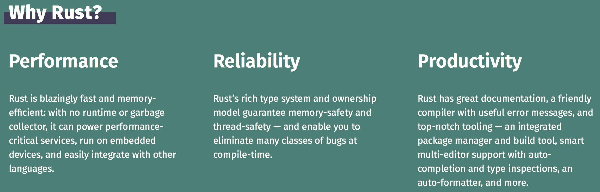

# Rust

Rust’s rich type system and ownership model guarantee memory-safety and thread-safety — and enable you to eliminate many classes of bugs at compile-time.

**Memory Safety**

> `Memory safety` is a property of programming languages where `all memory access is well defined`. Most programming languages in use today are memory-safe because `they use some form of garbage collection`. However, `systems-level languages` (i.e., languages used to build the underlying systems other software depends on, like OS kernels, networking stacks, etc.) which `cannot afford a heavy runtime like a garbage collector` are usually not memory-safe.
 

> First, there are plenty of fantastic memory safe languages already available and widely used inside and outside of Microsoft, including .NET languages like C# or F# and other languages like Swift, Go, and Python. We encourage anyone who is currently using C or C++ to consider whether one of these languages would be appropriate to use instead. We, however, are talking about the need for a safe systems programming language (i.e., a language that can build systems other software runs on, like OS kernels). Such workloads need the speed and predictable performance that C, C++, and Rust provide. Languages which achieve memory safety through `garbage collection are not ideal choices` for systems programming because their runtimes can lead to `unpredictable performance and unnecessary overhead`.

**Performance and control**

> Rust, just like C and C++, also gives the programmer fine-grained control on when and how much memory is allocated allowing the programmer to have a very good idea of exactly how the program will perform every time it is run. What this means for performance in terms of raw speed, control, and predictability, is that Rust, C, and C++ can be thought of in similar terms.

More about memory safety, please checkout the post series from Microsoft Security Response Center: [A proactive approach to more secure code](https://msrc-blog.microsoft.com/2019/07/16/a-proactive-approach-to-more-secure-code/), [We need a safer systems programming language](https://msrc-blog.microsoft.com/2019/07/18/we-need-a-safer-systems-programming-language), [Why Rust for safe systems programming?](https://msrc-blog.microsoft.com/2019/07/22/why-rust-for-safe-systems-programming/)

## REFs

- <https://www.rust-lang.org>
- The Rust Programming Language: <https://doc.rust-lang.org/book/>
- A 30 minute introduction to Rust: <https://words.steveklabnik.com/a-30-minute-introduction-to-rust>
- Rust for C++ programmers: <https://github.com/nrc/r4cppp>
- A proactive approach to more secure code: <https://msrc-blog.microsoft.com/2019/07/16/a-proactive-approach-to-more-secure-code/>
- We need a safer systems programming language: <https://msrc-blog.microsoft.com/2019/07/18/we-need-a-safer-systems-programming-language/>
- Why Rust for safe systems programming? <https://msrc-blog.microsoft.com/2019/07/22/why-rust-for-safe-systems-programming/>
